# Blog Website 

- This is a Blog website Build with RubyOnRails & Bootstrap
- This Website has 2 Type of user Access 
  1. Normal user
  2. Admin user

- #### 1. Normal User Access
  1. Create account
  2. Edit only your's account
  3. Delete your's account
  4. Create new article
  5. Edit only your's article
  6. Delete only your's article
  7. Show all categories
  8. Show other bloggers profile & articles

- #### 2. Admin User Access
  All Normal user's Access and these are some extra access
  1. Add new categories
  2. Delete normal/other users account With all articles
  3. Edit normal/other users article
  4. Delete normal/other users articles
---
## YouTube demo video link 

 - ### Project's YouTube video link :- https://youtu.be/a3Z-PQ89Z9M
---

#### This Project is part of [Udemy Course "The Complete Ruby on Rails Developer Course" ](https://www.udemy.com/course/the-complete-ruby-on-rails-developer-course/)

---

#### For more info OR suggestion contact me on

- ### My Twitter :- <a href="https://twitter.com/ramgopalsiddh1/"> Twitter/ramgopal </a>

- ### Portfolio :- <a href="https://ramgopal.dev/">ramgopal.dev</a>
---

## Screenshots

#### Home with out login
  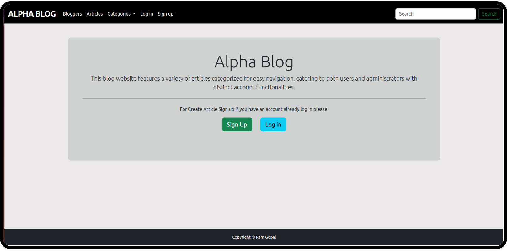

#### Log in 
  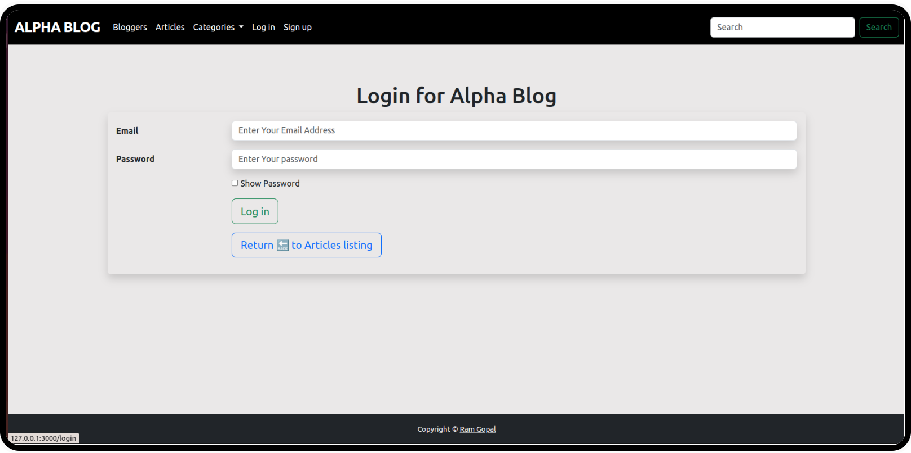

#### Log in with Wrong detail
  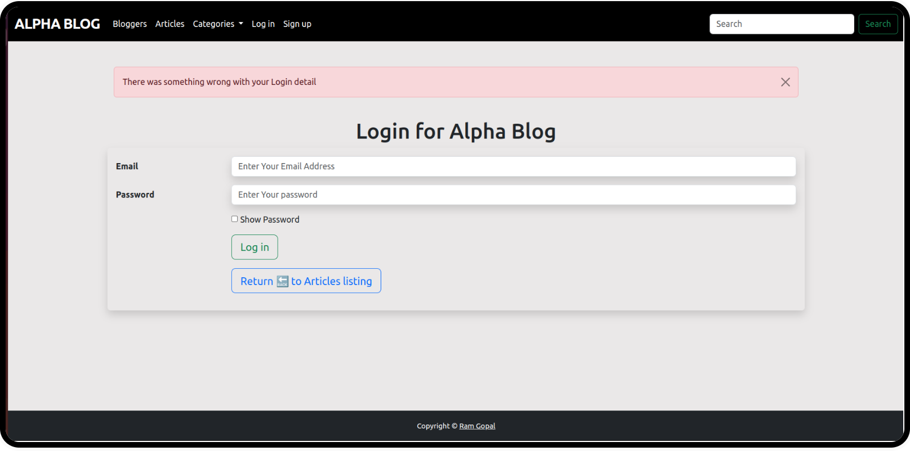

#### Show password function
  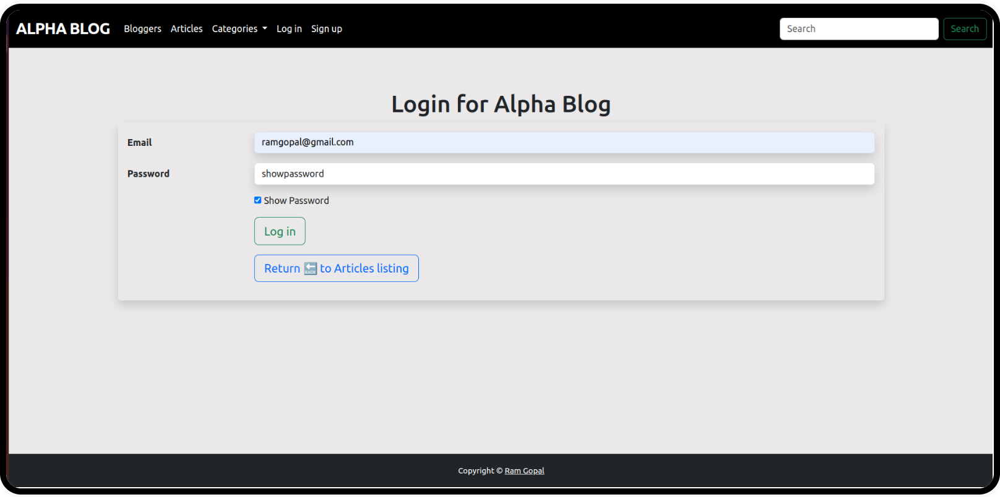

#### After Successfully Login
  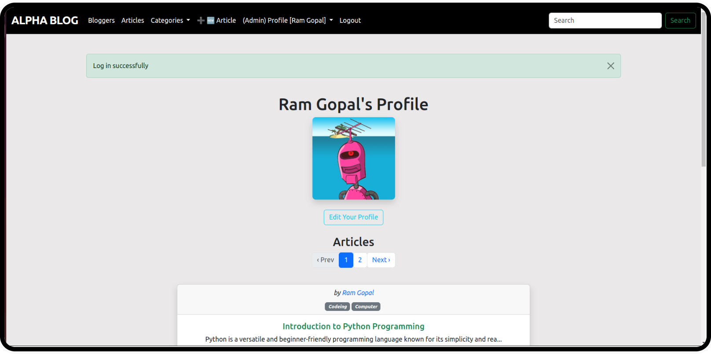

#### User profile 
  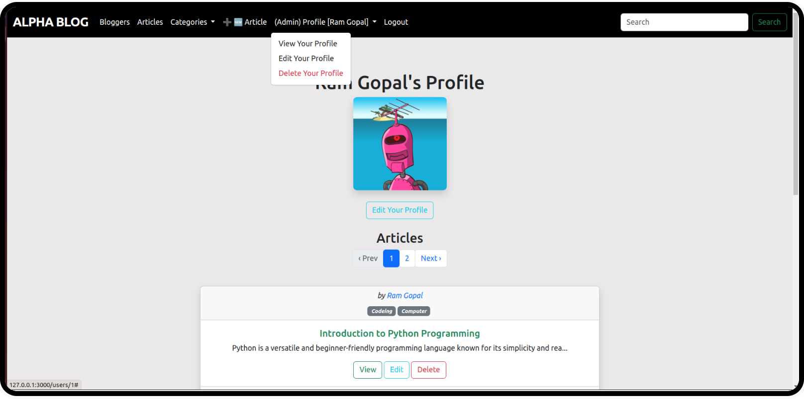

#### Edit Your Profile
  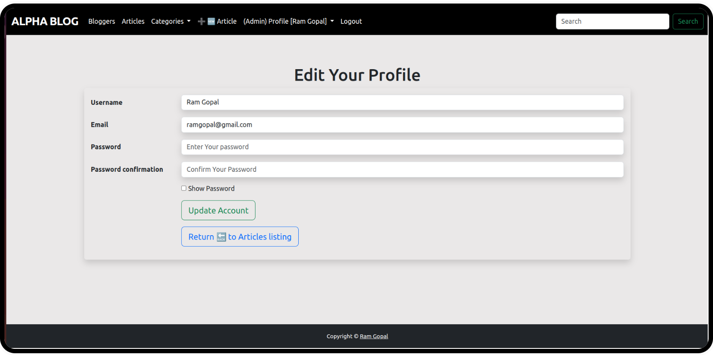

#### Delete your Profile
  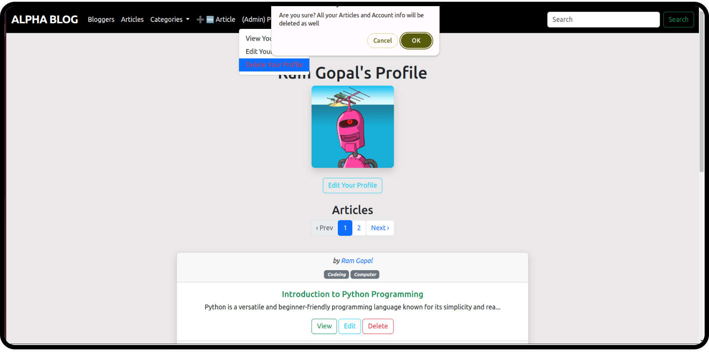

#### Bloggers Home Page
  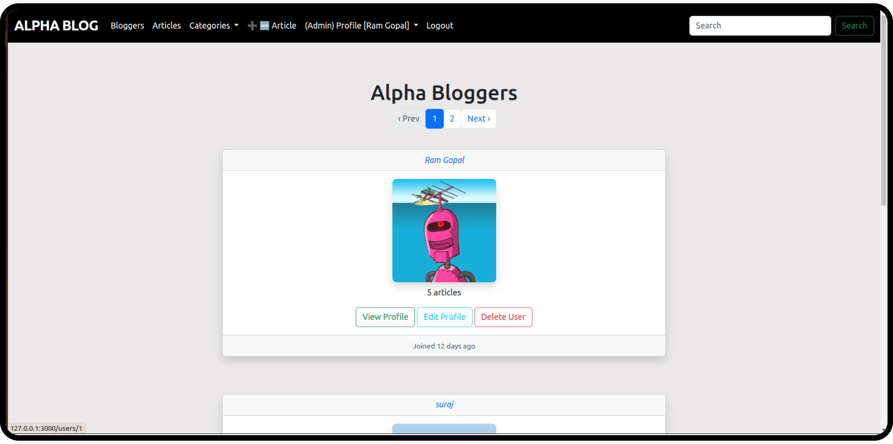

#### Admin have Access to delete othres Account
  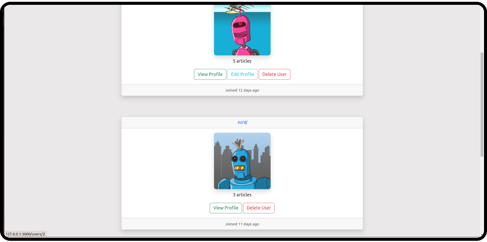

#### Articles Home Page
  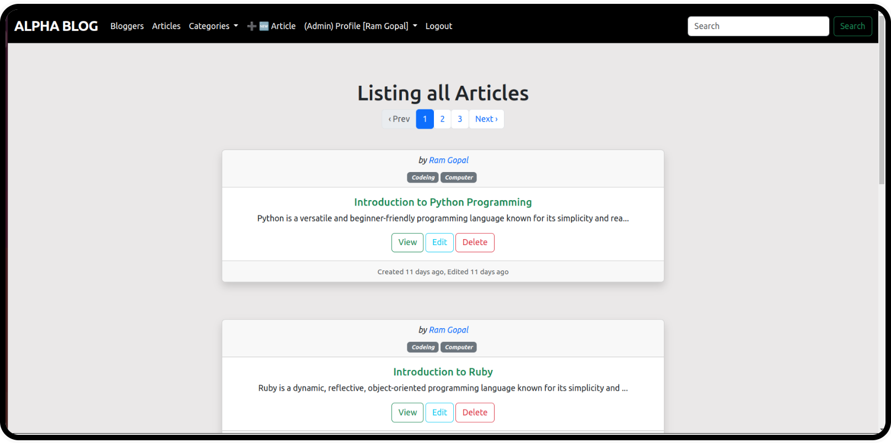

#### Create Article empty form
  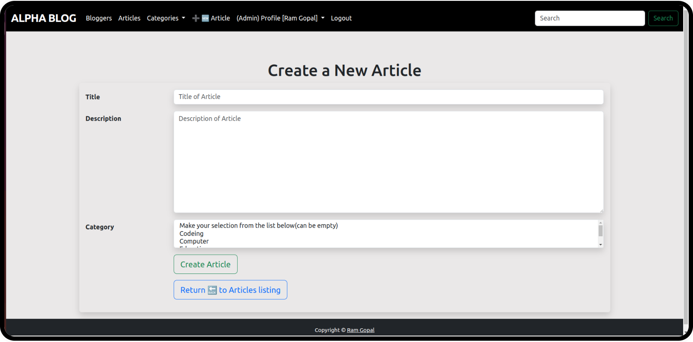

#### Try to create article without input
  

#### Create Article with input
  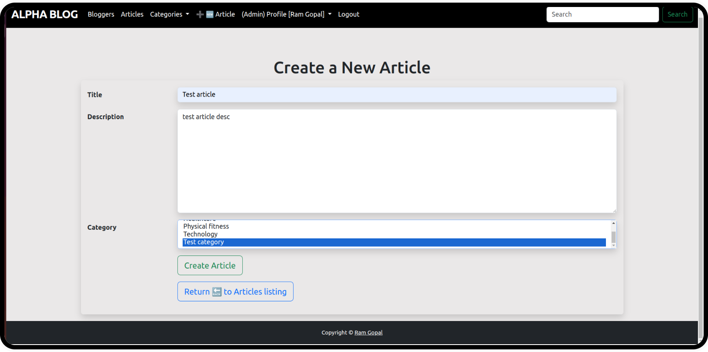

#### Create new article successfully
  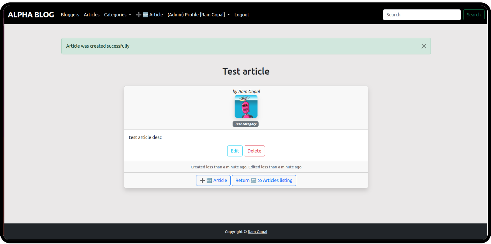

#### Edit Article
  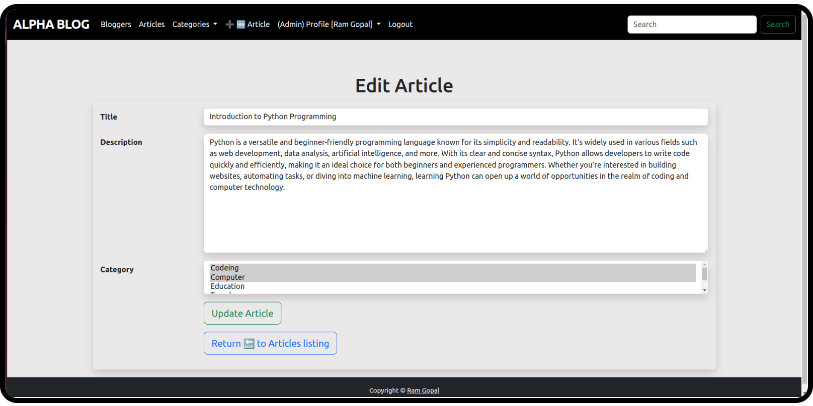

#### Delete Article
  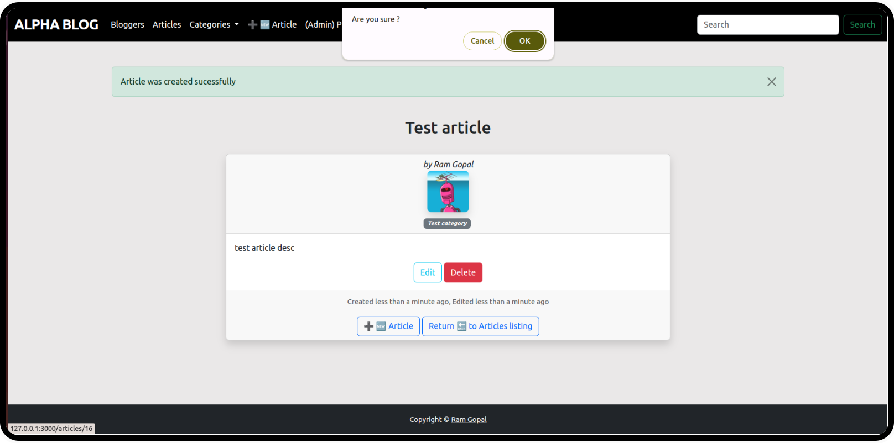

#### Option's in categories
  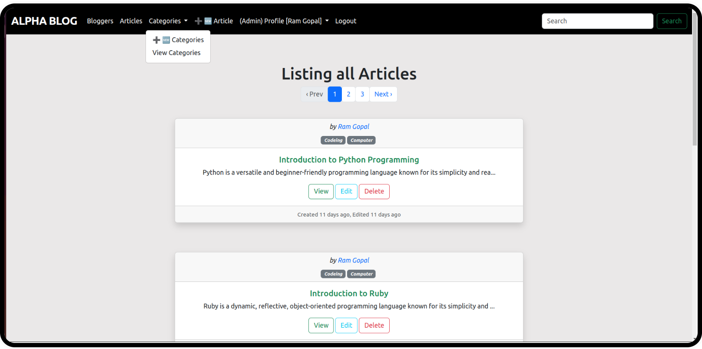

#### Create new categories form
  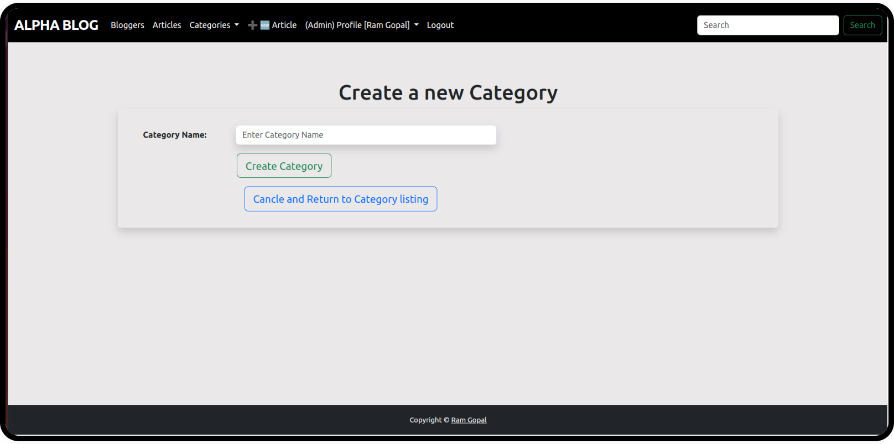

#### Show all categories
  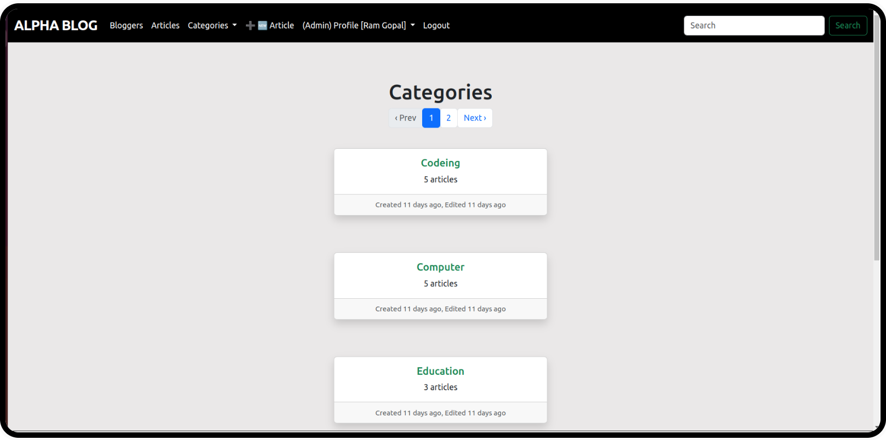

#### After Logout
  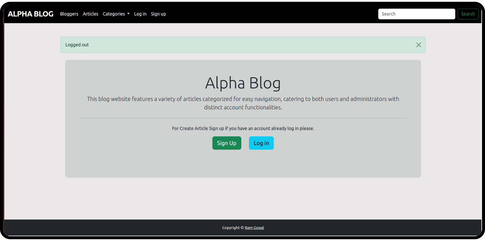

# README

This README would normally document whatever steps are necessary to get the
application up and running.

Things you may want to cover:

* Rails version: 7.1.3

* Ruby version: ruby 3.2.3 (2024-01-18 revision 52bb2ac0a6) [x86_64-linux]

* [I Foloow This Article for Add Bootstrap 5 in Rails 7  ](https://medium.com/@pietropugliesi/javascript-bootstrap-asset-bundling-in-ruby-on-rails-7-3640a220f2ce)

* System dependencies

* Configuration

* Database creation

* Database initialization

* How to run the test suite

* Services (job queues, cache servers, search engines, etc.)

* Deployment instructions

